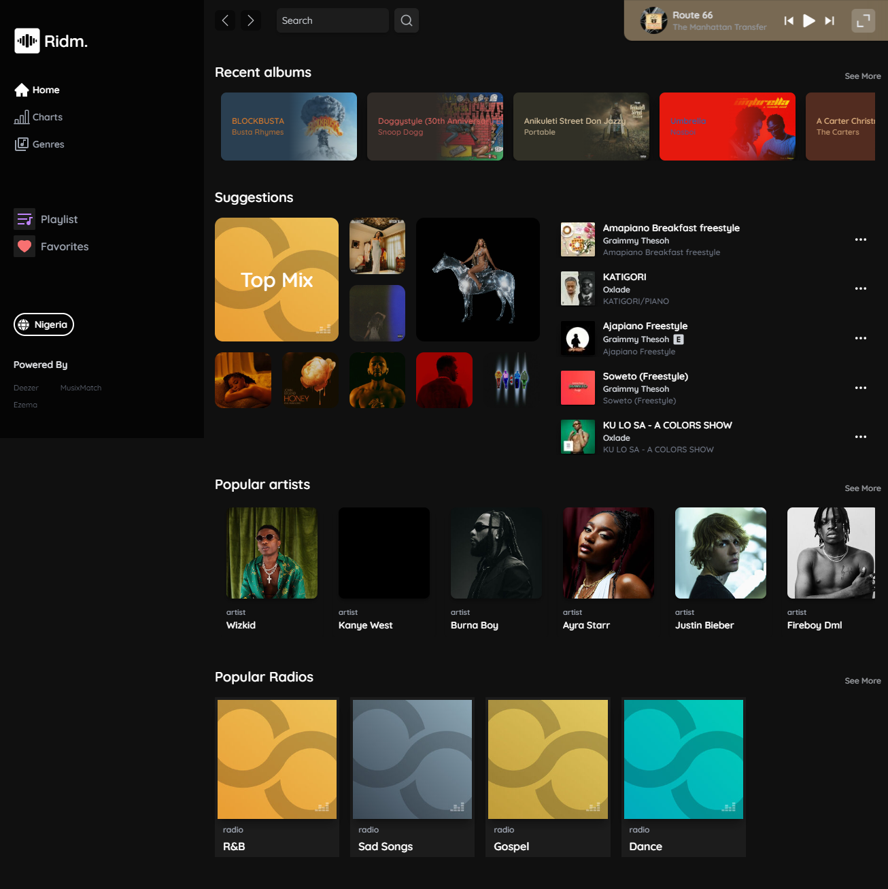
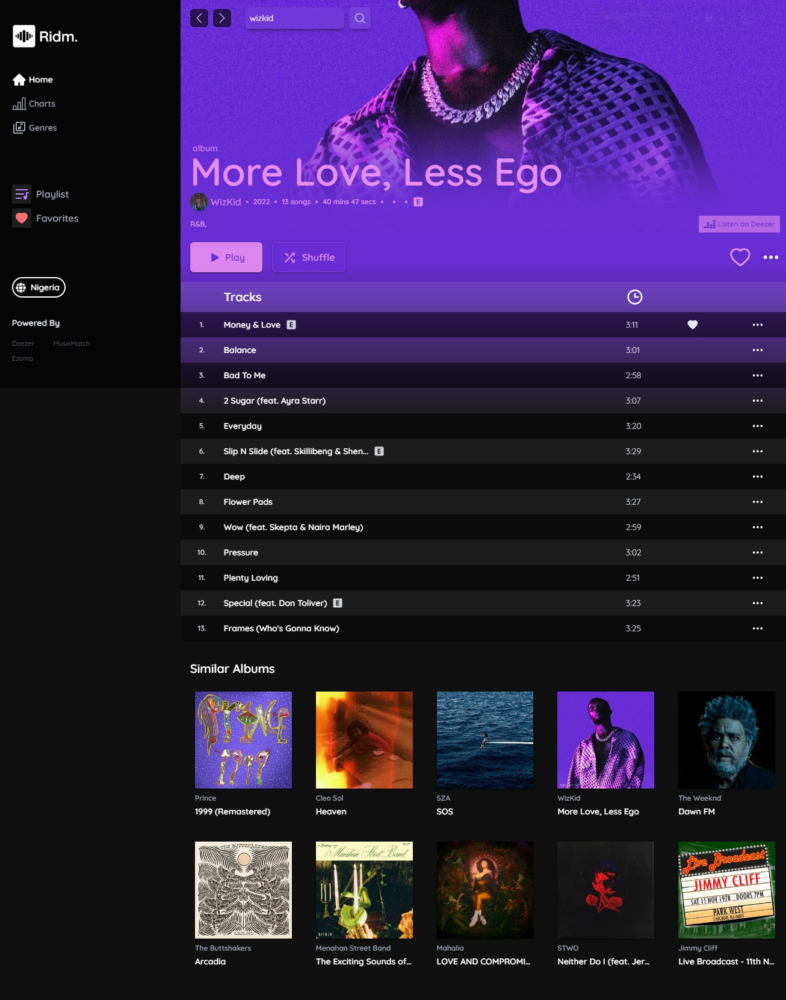
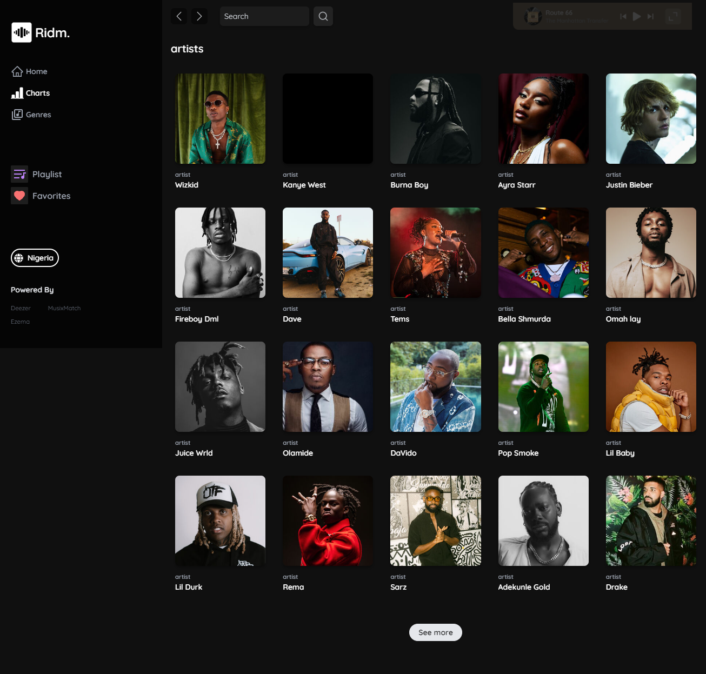
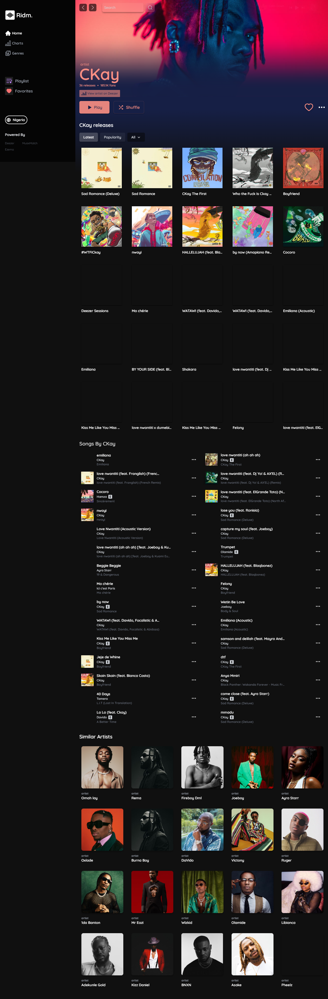
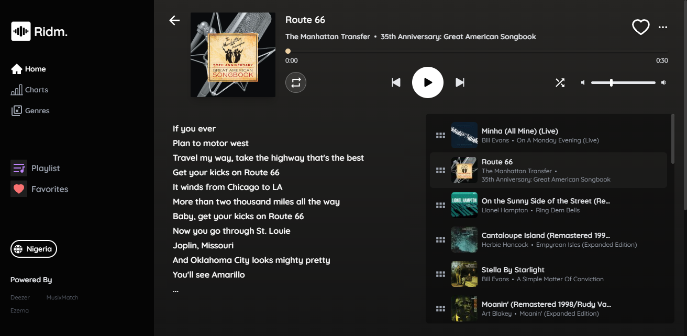
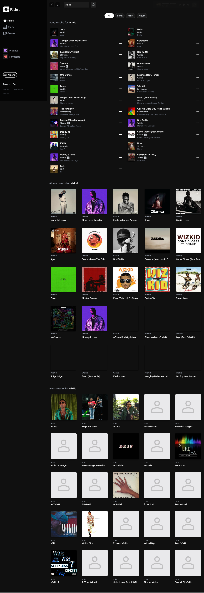

# Ridm - Web Player

## Overview

**Ridm - Web Player** is a dynamic and engaging full-stack project with a primary focus on frontend development. This project is a testament to my dedication and growth as a developer over the past two years. By leveraging technologies such as ReactJS, Tailwind CSS, Redux, Redux Toolkit, and Color Thief, I have created a web player that brings rhythm to everyone.

## Key Features

- **Deezer API Integration:** Ridm utilizes the Deezer API to seamlessly fetch songs, artist information, album details, genre data, and even radio content. This integration adds a rich layer of content to the web player, enhancing the user experience.

- **Musixmatch API for Lyrics:** To provide users with an immersive experience, the Musixmatch API is integrated to fetch accurate and synchronized lyrics for each song. This dual-API approach showcases my ability to work with diverse technologies and integrate them harmoniously.

- **Backend Proxy for CORS:** To resolve CORS-related errors, I implemented a backend proxy. This solution ensures smooth communication between the frontend and the Deezer and Musixmatch APIs, overcoming challenges and enhancing the project's reliability. [(Link to project here)](https://github.com/ennanuel/ridm-api-proxy).

## Technologies Used

- **ReactJS:** The project is built on the ReactJS library, ensuring a smooth and interactive user interface.

- **Tailwind CSS:** Tailwind CSS is employed for styling, allowing for a clean and visually appealing design.

- **Redux and Redux Toolkit:** These state management tools enhance the project's scalability and maintainability, ensuring efficient data flow.

- **Color Thief:** The Color Thief library is utilized to extract color palettes from album artwork, contributing to a visually cohesive design.

## Learning Highlights

- **API Integration Mastery:** Ridm challenged me to integrate two distinct APIs, Deezer and Musixmatch, fostering a deeper understanding of API interactions and data retrieval.

- **Responsive Design:** The project pushed the boundaries of my design skills, emphasizing the importance of creating not only aesthetically pleasing designs but also ensuring responsiveness across various devices.

- **Flexbox and Grid Layout:** A deeper understanding of Flexbox and Grid layout was gained, contributing to the creation of flexible and well-organized user interfaces.

- **Documentation Proficiency:** Ridm encouraged me to dive into documentation, enhancing my ability to comprehend and implement features by effectively navigating through technical documentation.

## Showcase

### Screenshots/GIFs

### Demo Link

[Live Demo](https:://ridm.netlify.app)

## Feedback

I invite you to explore this project and provide any feedback you may have. Your insights are valuable, and I appreciate your time in reviewing my work. Thank you for your consideration!
